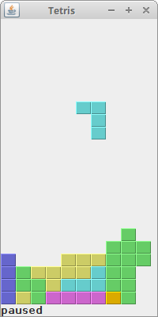

Tetris

The Tetris game is one of the most popular computer games ever created. The original game was designed and programmed by a Russian programmer Alexey Pajitnov in 1985. Since then, Tetris is available on almost every computer platform in lots of variations. Even my mobile phone has a modified version of the Tetris game.

Tetris is called a falling block puzzle game. In this game, we have seven different shapes called tetrominoes. S-shape, Z-shape, T-shape, L-shape, Line-shape, MirroredL-shape and a Square-shape. Each of these shapes is formed with four squares. The shapes are falling down the board. The object of the Tetris game is to move and rotate the shapes, so that they fit as much as possible. If we manage to form a row, the row is destroyed and we score. We play the tetris game until we top out.

Figure: Tetrominoes

The development

The tetrominoes are drawn using the Swing painting API. We use the java.util.Timer to create a game cycle. The shapes move on a square by square basis (not pixel by pixel). Mathematically the board in the game is a simple list of numbers.

The game starts immediately after it is launched. We can pause the game by pressing the p key. The space key will drop the Tetris piece immediately to the bottom. The d key will drop the piece one line down. (It can be used to speed up the falling a bit.) The game goes at constant speed, no acceleration is implemented. The score is the number of lines that we have removed.

The Shape class provides information about a Tetris piece. 
protected enum Tetrominoe {
    NoShape, ZShape, SShape, LineShape,
    TShape, SquareShape, LShape, MirroredLShape
}

The Tetrominoe enum holds seven Tetris shape names and the empty shape called NoShape.

coords = new int[4][2];
setShape(Tetrominoe.NoShape);

The coords array holds the actual coordinates of a Tetris piece.

int[][][] coordsTable = new int[][][]{
    {{0, 0}, {0, 0}, {0, 0}, {0, 0}},
    {{0, -1}, {0, 0}, {-1, 0}, {-1, 1}},
    {{0, -1}, {0, 0}, {1, 0}, {1, 1}},
    {{0, -1}, {0, 0}, {0, 1}, {0, 2}},
    {{-1, 0}, {0, 0}, {1, 0}, {0, 1}},
    {{0, 0}, {1, 0}, {0, 1}, {1, 1}},
    {{-1, -1}, {0, -1}, {0, 0}, {0, 1}},
    {{1, -1}, {0, -1}, {0, 0}, {0, 1}}
};

The coordsTable array holds all possible coordinate values of the Tetris pieces. This is a template from which all pieces take their coordiate values.

for (int i = 0; i < 4; i++) {

    System.arraycopy(coordsTable[shape.ordinal()], 0, coords, 0, 4);
}

